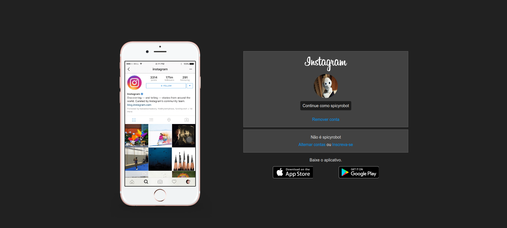
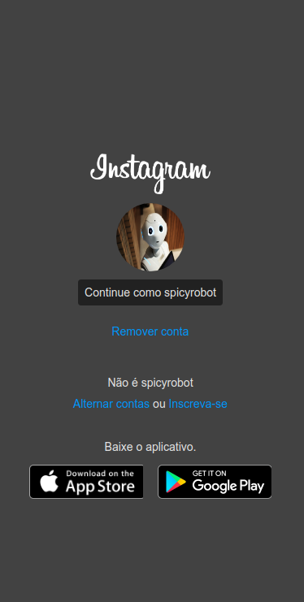

<p align="center">
    
</p>
<h3 align="center">
  Desafio de projeto: Landing page do Instagram
</h3>

<p align="center">
  <a href="#rocket-sobre-o-desafio">Sobre o desafio</a> |
  <a href="#memo-preview">Preview</a> |
  <a href="#wrench-como-testar-a-aplicação-no-seu-computador">Como testar a aplicação</a>
</p>

## :rocket: Sobre o desafio
O objetivo desse desafio é criar uma pequena aplicação para fixar os conceitos sobre HTML5 e CSS3, adicionando responsividade utilizando flexbox e media queries.

## :memo: Preview
### Web
<p align="center">
    
</p>

### Mobile
<p align="center">
    
</p>

## :wrench: Como testar a aplicação no seu computador
Primeiramente você deve clonar esse repositório em sua máquina, que nada mais é que baixar os arquivos aqui dispostos. Para isso, você pode baixar os arquivos clicando no botão verde escrito <em>Clone or download</em> e baixar o projeto como um arquivo ZIP (descompacte os arquivos em algum local do seu computador), ou pode clonar utilizando um terminal com git.

```bash
git clone https://github.com/pfreitasbarbosa/instagram-landing-page.git
```

Depois, navegue até a pasta que você clonou o repositório e abra o arquivo `index.html` em seu navegador (basta clicar duas vezes no arquivo).
